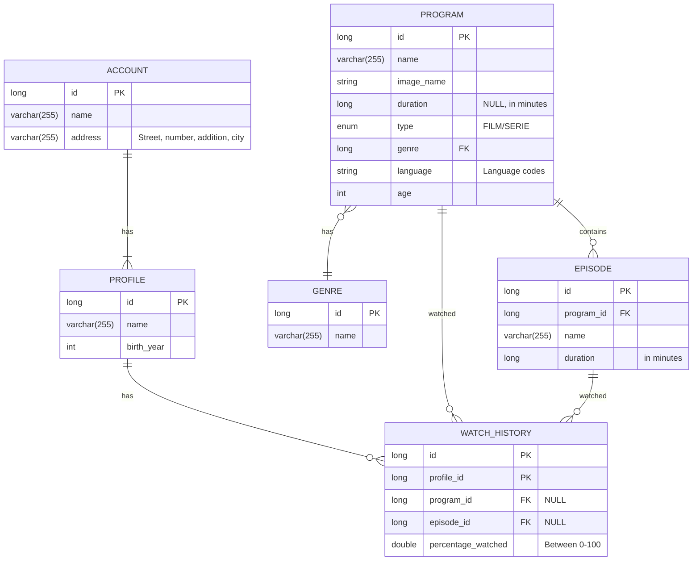

```mermaid
erDiagram
    PROGRAM ||--o{ EPISODE : contains
    PROGRAM }o--|| GENRE : has

    ACCOUNT ||--|{ PROFILE : has

    PROFILE ||--o{ WATCH_HISTORY : has
    PROGRAM ||--o{ WATCH_HISTORY : watched
    EPISODE ||--o{ WATCH_HISTORY : watched

    PROGRAM {
        long id PK
        varchar(255) name
        string image_name
        long duration "NULL, in minutes"
        enum type "FILM/SERIE"
        long genre FK
        string language "Language codes"
        int age
    }
    EPISODE {
        long id PK
        long program_id FK
        varchar(255) name
        long duration "in minutes"
    }
    GENRE {
        long id PK
        varchar(255) name
    }

    ACCOUNT {
        long id PK
        varchar(255) name
        varchar(255) address "Street, number, addition, city"
    }
    PROFILE {
        long id PK
        varchar(255) name
        int birth_year
    }

    WATCH_HISTORY {
        long id PK
        long profile_id PK
        long program_id FK "NULL"
        long episode_id FK "NULL"
        double percentage_watched "Between 0-100"
    }
```
